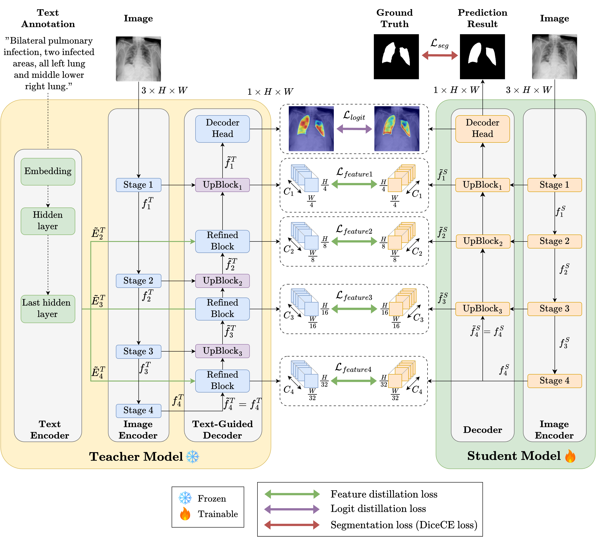

# Pytorch implementation of paper **From Text-Guided to Text-Free Medical Image Segmentation via Knowledge Distillation**

## Framework



## Requirements
1. Environment: the main mandatory dependency versions are as follows:  
    ```
    python=3.10.19
    pytorch_lightning==1.9.0  
    torchmetrics==0.10.3  
    transformers==4.57.3
    monai==1.0.1  
    pandas==1.4.2  
    einops==0.4.1 
    open_clip_torch==2.32.0
    python==3.10.19
    numpy==1.26.4
    scipy==1.15.3
    ```

## Dataset
1. QaTa-COV19 Dataset (images & segmentation mask)  
    [QaTa-COV19 Dataset on Kaggle](https://www.kaggle.com/datasets/aysendegerli/qatacov19-dataset)

    **We use QaTa-COV19-v2 in our experiments.**

2. MosMedData+ Dataset (images & segmentation mask) [MosMedData+ Dataset on Kaggle](https://www.kaggle.com/datasets/maedemaftouni/covid19-ct-scan-lesion-segmentation-dataset)

3. Text Annotations (from thrid party)  
    Check out the related content in [LViT-TMI'23](https://github.com/HUANGLIZI/LViT)

    **Thanks to Li et al. for their contributions. If you use this dataset, please cite their work.**

For easily reproducing, we have uploaded all the above data in [Google Drive link](https://drive.google.com/drive/folders/1cqVHjju2nODHz3_miwFH1ez9QYVMJbPW?usp=sharing)
## QuickStart
To evaluate teacher model, check out the folder config_teacher and the following command line:
```bash
python evaluate.py --config config_teacher/training_qata.yaml
```

To evaluate student model, check out the folder config_kd and the following command line:
```bash
python evaluate.py --config config_kd/training_qata.yaml
```

We release our checkpoints at this [Google Drive link](https://drive.google.com/drive/folders/1YT1nGsoDBHrZ3eGObg17tNIQMafSl1me?usp=sharing)

## Acknowledgements
This codebase is built based on [LanGuideMedSeg-MICCAI2023](https://github.com/Junelin2333/LanGuideMedSeg-MICCAI2023). We thank their authors for making the source code publicly available.
